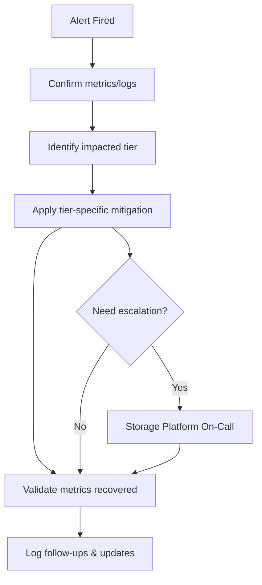

# BOP AOF Operations

## Purpose
Define operational practices for bop-aof deployments, covering monitoring, maintenance, release coordination, and cross-team responsibilities. Pair this with the incident-focused runbook for reactive workflows.

## Audience
- Site Reliability Engineers accountable for durability and latency SLOs.
- Platform engineers managing deployments and configuration rollouts.
- Support leads preparing readiness material for customer-facing teams.

## Prerequisites
- Dashboards for Tier 0/1/2 metrics, flush pipeline, and manifest health (Grafana templates upcoming).
- Access to bop-aof CLI tooling and configuration management systems.
- Awareness of stakeholders listed in [Milestone 1 Summary](m1_foundation_summary.md).

## Quick Start
1. **Pre-launch checklist**: Verify tier budgets, retry policies, and alert thresholds match documented baselines.
2. **Dashboard dry-run**: Import shared dashboards and confirm metrics flow before enabling customer traffic.
3. **Runbook rehearsal**: Walk through the [Operational Runbook](../aof2/aof2_runbook.md) to ensure on-call familiarity.

## Key Tasks
- **Daily**: Review activation queue depth, hydration latency, Tier 2 retry counters; log anomalies in the ops journal.
- **Weekly**: Rotate logs, validate object-store retention policies, reconcile manifest snapshots with expected counts.
- **Monthly**: Re-run capacity forecasts, align Tier 0/1 budgets with growth, and review object-store cost reports.
- **Release windows**: Seal active segments, verify API/CLI compatibility changes, and communicate runbook deltas.

## Monitoring & Alerts
| Metric / Alert | Source | Recommended Threshold | Action |
| --- | --- | --- | --- |
| `activation_queue_depth` | Tier 0 dashboard | Alert if > 0 for 60s | Increase Tier 0 budget or accelerate segment sealing. |
| `hydration_latency_p99_ms` | Tier 1 dashboard | Alert if > 2000 ms for 5 min | Investigate Tier 1 retries, Tier 2 availability, and hydration queue backlog. |
| `upload_retry_attempts` | Tier 2 dashboard | Alert on +10/min trend | Validate object-store health; consider failover or throttling. |
| `flush_failures` / `metadata_failures` | Flush metrics | Any non-zero | Escalate immediately; follow runbook mitigation steps. |
| `tier2_fetch_failed` (log-based) | Structured logs | >2 events in 5 min | Trigger hydration recovery steps, ensure Tier 2 healthy. |

## Health Check Flow

_Source: `docs/bop-aof/media/operations-health-check-flow.mmd`._

## Runbook Integration
- Link each alert to the runbook section that describes mitigation so on-call responders can pivot quickly.
- Store recent `aof2-admin dump` outputs in the incident workspace; they serve as ground truth for tier residency.
- After any mitigation, update the runbook `Post-Incident Tasks` checklist to capture new insights.

## Maintenance Calendar
| Cadence | Task | Owner |
| --- | --- | --- |
| Weekly | Validate Tier 2 bucket lifecycle rules | SRE |
| Weekly | Refresh `aof2-admin` CLI on admin hosts | Tooling & DX |
| Monthly | Review retry policy effectiveness and adjust thresholds | Storage Platform |
| Quarterly | Re-run disaster recovery simulation using manifest replay | SRE + Storage Platform |

## Configuration Management
- Manage configuration via version-controlled TOML files checked into your infra repo; avoid ad-hoc runtime edits.
- Parameterize Tier 0/1 budgets and retry policies to support environment-specific overrides.
- Audit secrets (Tier 2 credentials) through the existing secret management system; never commit them to the docs repository.

## Release Coordination
1. Seal active segments with `aof2-admin seal --stream <name>` prior to deploying new binaries.
2. Monitor `manifest.replay_version` and flush metrics during rollout; abort if replay deviates from expected values.
3. Update [API Guide](api-guide.md) and [CLI Reference](cli-reference.md) if new features or flags ship.
4. Log release notes and follow-ups in `docs/bop-aof/progress_tracker.md` under the appropriate milestone.

## Troubleshooting Patterns
| Scenario | Checklist |
| --- | --- |
| Hydration backlog persists | Increase Tier 1 workers, validate Tier 2 endpoint, consult Runbook mitigation table. |
| Flush slowdown | Compare append vs flush rate, inspect disk IO, consider temporary ingest throttles. |
| Tier 2 partial outage | Execute failover plan, capture incident metrics, coordinate with platform networking. |
| Manifest mismatch | Run `aof2-admin manifest check`, reconcile with stored snapshots, prepare repair plan. |

## Escalation & Communication
- Primary escalation: Storage Platform On-Call.
- Secondary: Site Reliability Engineering for infrastructure issues.
- Tertiary: Docs Lead for updates impacting external communication.
Document incident summaries in the shared project board (`bop-aof-docs`) to maintain visibility.

## Related Resources
- [Milestone 2 Review Notes](review_notes.md)
- [CLI Reference](cli-reference.md)
- [API Guide](api-guide.md)
- [AOF2 Implementation Plan](../aof2/aof2_implementation_plan.md)
- [AOF2 Runbook](../aof2/aof2_runbook.md)
- [Milestone 1 Summary](m1_foundation_summary.md)

## Changelog
| Date | Change | Author |
| --- | --- | --- |
| 2025-09-24 | SME sign-off and health-check flow added | Docs Team |
| 2025-09-23 | Expanded operations playbook with monitoring, maintenance, and escalation guidance | Docs Team |
| 2025-09-23 | Drafted operational baseline and maintenance checklist | Docs Team |
